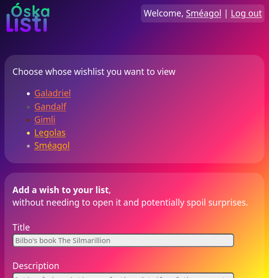
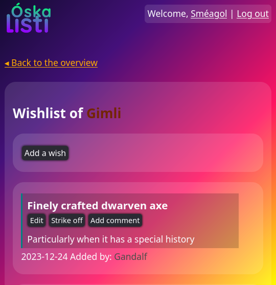
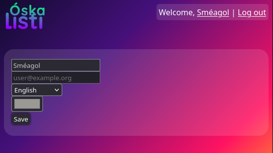

# Óskalisti

Simple wishlist software for a group of friends and/or family

It was made to be simple both in terms of user interface, as well as in terms of system requirements (it can run on a free webhost!).

Vision-impaired users should be able to use the software without much trouble due to the no-frills layout and extended use of standard HTML components.

## Getting started

1. Set up a standard LAMP/WAMP stack, or use a (free) webhost
   - `mail()` needs to be functional for sending login emails
   - PHP 7.0 (or newer) is needed for the `random_bytes()` function
   - Any web server will work (Apache's `.htaccess` is not used, resulting in ugly URLs but better portability)
   - Wikipedia has [an overview](https://en.wikipedia.org/w/index.php?title=LAMP_(software_bundle)&oldid=1193247209#External_links) of various LAMP setup guides
   - Windows users might like <https://www.wampserver.com> or <https://www.apachefriends.org>
2. Place the files in the desired directory within your document root
   - This could be `/var/www/html`, `C:\XAMPP\htdocs`, or something else depending on your installation environment. Subdirectories work out of the box.
   - Having `.git` and other auxiliary files accessible is not a problem because the source is open anyway, but if you want to trim it to the essentials, you could remove: `README* .gitignore .git/`
3. Copy `config-example.php` to `config.php` and set at least the database name, username, and password
   - If you need to manually create a database user, this might work (depending on your setup):
     1. `$ sudo mariadb`
	 1. `> CREATE DATABASE 'oskalisti';`
	 1. `> CREATE USER 'newuser'@'localhost' IDENTIFIED BY 'P@ssw0rd!';`
	 1. `> GRANT ALL PRIVILEGES ON oskalisti.* TO 'newuser'@'localhost';`
4. Create an Óskalisti account for yourself: `INSERT INTO oskalisti.users (email, name, admin) VALUES('you@example.org', 'Galadriel', 1);`
   - Customize the database name `oskalisti` if you chose a different name
5. Done!

You can now open the website in your browser, log in, and invite others using the administration screen.
Creating more administrators is done by setting the person's `isadmin` field to `1` in the database.

## Improvements

Features that would be nice to have:

- Allowing people to configure who can see their list, such that different groups of people can use one installation of Óskalisti (so long as they all know an administrator that can invite them)
- Being able to use a password to log in, for those who prefer that. Considerations:
  - Everyone's list can be seen or modified using the weakest login
  - The current email-based login is fairly strong without relying on people remembering or otherwise managing strong and unique passwords, but power users often prefer using a password manager
- Supporting uploading more than one image per wish
- Supporting alt texts for user-uploaded images. People can work around this currently by just adding the extra information in the wish's description.
- Improve image zooming. The current system breaks the layout on some mobile browsers (while zooming). Maybe images should simply open in a new tab rather than enlarging inline?
- See a few technical `TODO`s in the code, e.g.: client-side image size checking or language header parsing

Other improvements or feature requests are also welcome!

## Trivia

- Óskalisti means wishlist in Icelandic, breaking down as óska for wish (it shares a root with the English word "ask") and listi for list
- Wenslys (Afrikaans) was the original name of the project, but whenever the developer glanced over that word in their browser, it made them think of Wendy's
- Initial development was started on 2023-11-26
- SVG image uploads are supported because SVG is awesome, but this lead to a cross-site scripting vulnerability when a user opens the uploaded SVG in a new tab or otherwise views it directly.
  An SVG can contain scripts and this is executed in the website's context when the image is rendered outside of an &lt;img&gt; tag. This was caught before the first release and a
  Content Security Policy header now denies script execution for such images. Safety advice was also added to relevant Stackoverflow pages so others hopefully don't make the same mistake.

